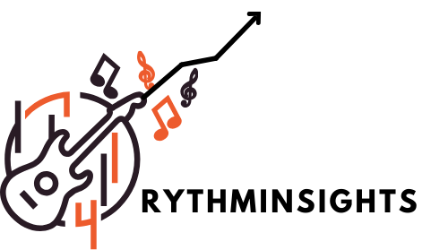

 
 

 This project utilizes the Spotify API to extract data such as track information, user top artists, and user listening habits. It then processes this data to generate an [HTML file](http://htmlpreview.github.io/?https://github.com/romisadeh/rhythminsights/blob/main/assets/spotifyApi.html) for visualizing trends, favorite tracks, and personalized recommendations. Perfect for exploring your Spotify data in a user-friendly format!  

 **Features:**

- Uses API to extract data from user's spotify account.
- Extract user's top tracks and artist based on long term listening habits.
- Exports an HTML file with statistics about user's tracks and albums.
- Extract user's top album image cover.
- Updates accourding to your listening and spotify habit changes.
- Generate a personal recommendation based on user's top artists. 

## Requierments:
- spotipy
- seaborn

## Quick start:
To run code user must first get spotify client Id, client secret, username and redirect URI.  
Enter [Spotify For Developers](https://developer.spotify.com/) and create app.  
After creation you will be able to enter app dashboard. In setting you will get all the information needed to run file.

